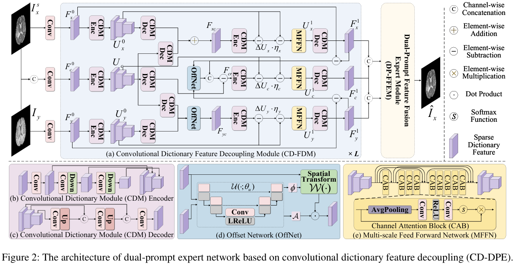
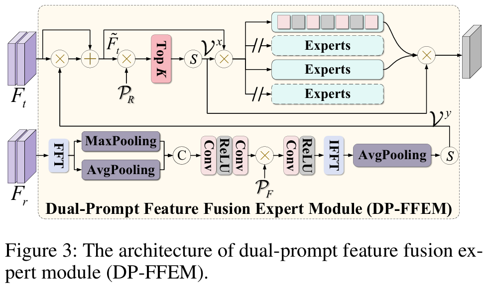
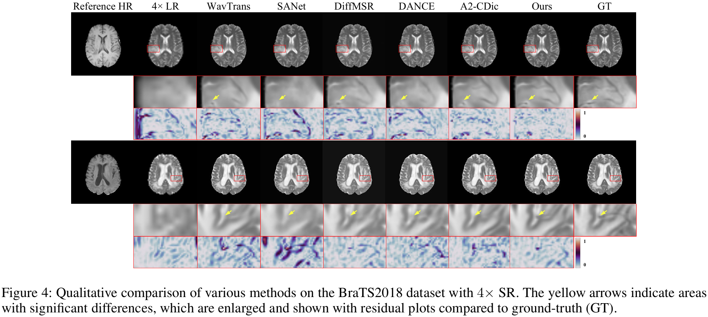
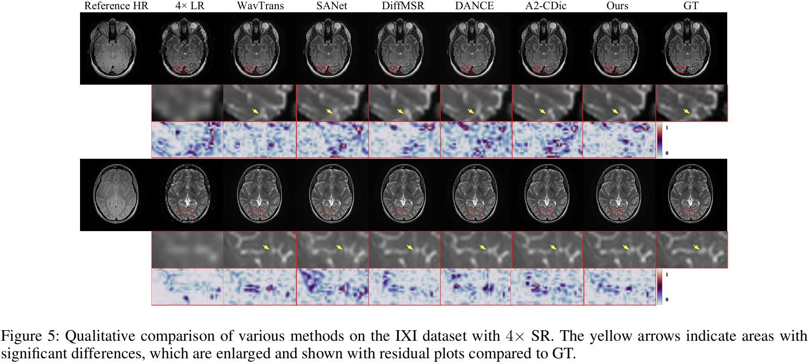
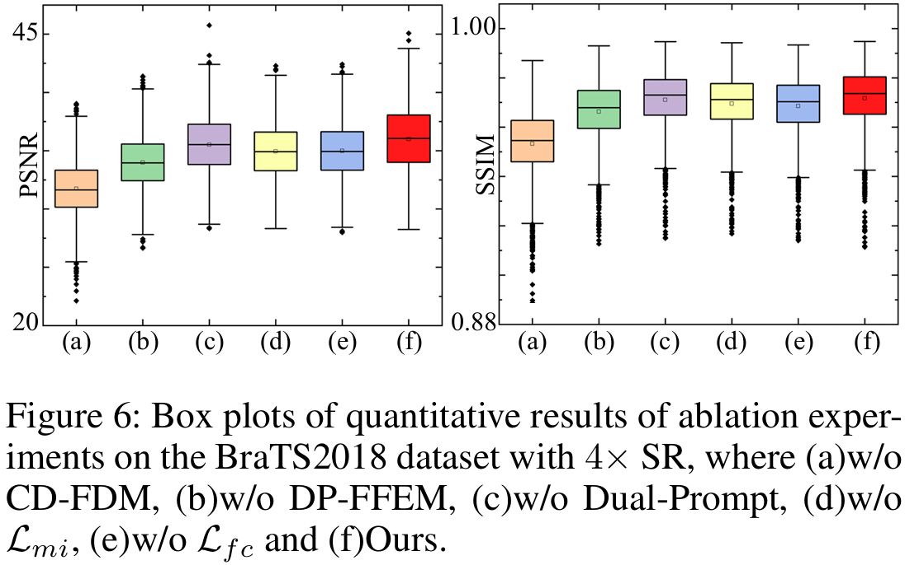
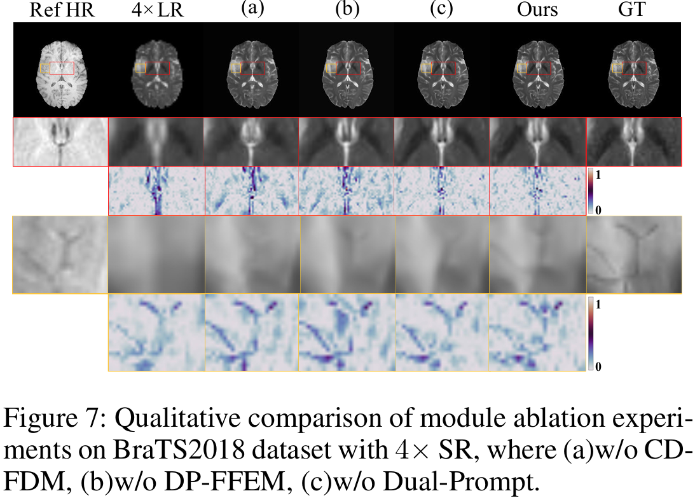
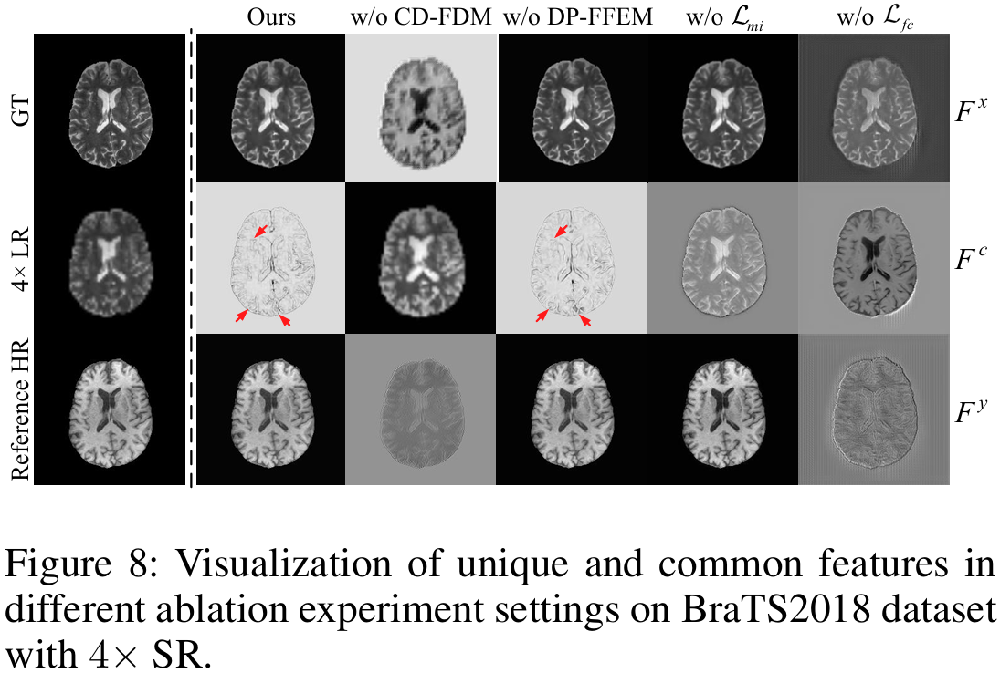
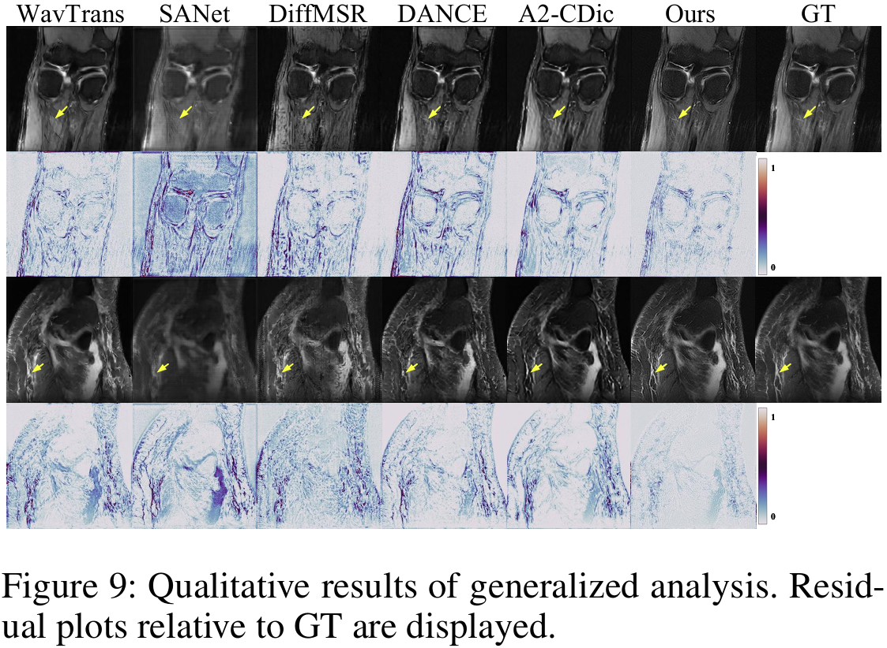

# [AAAI 2026] CD-DPE: Dual-Prompt Expert Network based on Convolutional Dictionary Feature Decoupling for Multi-Contrast MRI Super-Resolution

Xianming Gu<sup>1</sup>, Lihui Wang<sup>1,∗</sup>, Ying Cao<sup>1</sup>, Zeyu Deng<sup>1</sup>, Yingfeng Ou<sup>1</sup>, Guodong Hu<sup>1</sup> and Yi Chen<sup>1,2</sup>

<sup>1</sup> Key Laboratory of Advanced Medical Imaging and Intelligent Computing of Guizhou Province,
Engineering Research Center of Text Computing & Cognitive Intelligence, Ministry of Education,
College of Computer Science and Technology, Guizhou University, Guiyang, China

<sup>2</sup> The D-Lab, Department of Precision Medicine, GROW-School for Oncology and Reproduction,
Maastricht University, 6200 MD Maastricht, the Netherlands

<sup>*</sup> Corresponding author.

-*[Paper]*: [[AAAI]](https://ojs.aaai.org/index.php/AAAI/article/view/42430)

-*[Email]*: [xianming_gu@foxmail.com](mailto:xianming_gu@foxmail.com) (Xianming Gu)

-[*[Supplementary Materials]*](https://github.com/xianming-gu/CD-DPE/blob/main/Supplementary-material/Supplementary-material.pdf)


## Citation

```
@inproceedings{gu2026cd,
  title={CD-DPE: Dual-Prompt Expert Network Based on Convolutional Dictionary Feature Decoupling for Multi-Contrast MRI Super-Resolution},
  author={Gu, Xianming and Wang, Lihui and Cao, Ying and Deng, Zeyu and Ou, Yingfeng and Hu, Guodong and Chen, Yi},
  booktitle={Proceedings of the AAAI Conference on Artificial Intelligence},
  volume={40},
  number={6},
  pages={4329--4338},
  year={2026}
}
```


## Abstract

Multi-contrast magnetic resonance imaging (MRI) super-resolution intends to reconstruct high-resolution (HR) images from low-resolution (LR) scans by leveraging structural information present in HR reference images acquired with different contrasts. This technique enhances anatomical detail and soft tissue differentiation, which is vital for early diagnosis and clinical decision-making. However, inherent contrasts disparities between modalities pose fundamental challenges in effectively utilizing reference image textures to guide target image reconstruction, often resulting in suboptimal feature integration. To address this issue, we propose a dual-prompt expert network based on a convolutional dictionary feature decoupling (CD-DPE) strategy for multi-contrast MRI super-resolution. Specifically, we introduce an iterative convolutional dictionary feature decoupling module (CD-FDM) to separate features into cross-contrast and intra-contrast components, thereby reducing redundancy and interference. To fully integrate these features, a novel dual-prompt feature fusion expert module (DP-FFEM) is proposed. This module uses a frequency prompt to guide the selection of relevant reference features for incorporation into the target image, while an adaptive routing prompt determines the optimal method for fusing reference and target features to enhance reconstruction quality. Extensive experiments on public multi-contrast MRI datasets demonstrate that CD-DPE outperforms state-of-the-art methods in reconstructing fine details. Additionally, experiments on unseen datasets demonstrated that CD-DPE exhibits strong generalization capabilities.

## Usage

### Network Architecture

Our CD-DPE is implemented in ``cddpe.py``.

### Training
**1. Virtual Environment**
```
# create virtual environment
conda create -n cddpe python=3.9
conda activate cddpe
# select pytorch version yourself
# install cddpe requirements
pip install -r requirements.txt
```

**2. Data Preparation**

Download the BraTS2018 dataset from [this link](https://www.med.upenn.edu/sbia/brats2018/data.html), and the IXI dataset from [this link](https://brain-development.org/ixi-dataset/). Then place the files in the folder ``'./BraTS2018/'`` and ``'./IXI/data/'``

BraTS2018contains 285 preprocessed, spatially aligned multi-contrastMRI scans. We use the central 50 slices (240 × 240) from each scan, with T1W as the reference to reconstruct T2W, yielding over 11,000 training and 2,800 test pairs.The IXI dataset  includes 576 similarly preprocessed scans, from which 50 central slices (256 × 256) are selected.PD is used to guide
 T2W reconstruction, resulting in over 23,000 training and 5,700 test pairs.LR images are generated by downsampling HR images by a factor of 2× or 4×, and a reupsampled via
 interpolation for network input.

**3. CD-DPE Training**

Modify the type and settings of fusion task in ``Options_CDDPE.py``.

Run 
```
python Train_CDDPE.py
``` 
and the trained model is available in ``'./modelsave/'``.

### Testing

**1. CD-DPE Testing**

Please put the model in the folder ``'./modelsave/``.

Modify the type and settings of fusion task in ``Options_CDDPE.py``

Run 
```
python Test_CDDPE.py
``` 
and the results is available in ``'./result/'``.


## CD-DPE

### Illustration of our CD-DPE model.





### Qualitative super-resolution results.





### Ablation studies results.







### Generation studies results.


